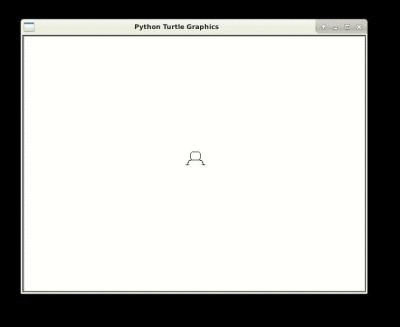
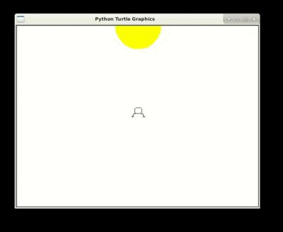
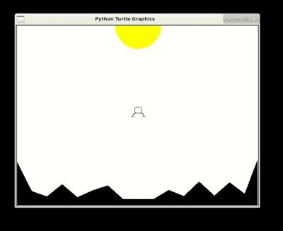

## Warming up

Before we start, if it's not done already, please install a [decent
editor](Installing-Python3-on-Linux#installing-a-decent-editor).
Install python3 to get the engine working (```sudo apt-get install
python3-tk``` if you happen to use a Linux machine).  And finally,
download and unpack the [game
engine](http://pages.cpsc.ucalgary.ca/~aycock/engine.tar.gz).

You can shortly try the provided games as an appetizer:
```
python3 invader.py
python3 missile.py
python3 nightdriver.py
python3 asteroids.py
python3 target.py
```

You can try to read the source code of these game but their complexity
is not a good introduction to the framework.  You could prefer the
eg-*.py example files that are much simpler. 

Please have a look at the box example, reproduced here:
``` python
import engine

WIDTH = 640
HEIGHT = 480

class Box(engine.GameObject):
	def __init__(self):
		super().__init__(0, 0, +1, 0, 'square', 'red')

if __name__ == '__main__':
	engine.init_screen(WIDTH, HEIGHT)
	engine.init_engine()
	box = Box()
	engine.add_obj(box)
	engine.engine()
```

If you run it (with ```python3 eg-box.py```), you can see that it
creates a red box that moves slowly to the right. Of course, we don't
understand everything in this example, but we will try to modify it
anyway.

Instead of this boring right move, we build some more chaotic
behavior. Change the line beginning with super() as follows (+1 became
0), and restart it.  
``` python
		super().__init__(0, 0, 0, 0, 'square', 'red')
```

The box does not move on its own anymore. Now add the following right
below that line, and restart it.
``` python
	def move(self):
		self.x += 2
		self.y += 1
```

Aha. It moves as expected. Try importing the [random
module](https://docs.python.org/3/library/random.html) in your script,
and play a bit with the
[random.randrange()](https://docs.python.org/3/library/random.html#random.randrange)
function to get your square moving frantically on screen.

Once it's done, have a look at the eg-keybox.py example, and make sure
that the "game" stops when the Escape key is pressed. Check the (very
short) [API
reference](https://github.com/mquinson/retrogames/blob/master/engine-reference.pdf)
to see how to stop the engine.

You can also learn from ```eg-box-exit.py``` to ensure that your game
stops when the box moves out ot the screen.

## A game skeleton

We will now write a simple game where you should control the descent
of a lander module so that it lands safely. The gravity tends to
increase the lander speed continuously, and if the lander hits the
ground too quickly, it scratches.

Add a global variable to your program by adding a line that reads:
```speed = 0``` near the top. Then modify your ```move(self)```
function so that the y position is decreased by speed and speed itself
is increased by 0.1. Remember that in Python, every function that
wants to access a global variable must declare it. Your method will
probably read as follows:
``` python
	def move(self):
		global speed
		self.y -= speed
		speed += 0.5
```

Now, change your keyboard handler so that pressing on space decreases
a bit the descent speed, as would a reactor do. Tinker a bit with your
game to get the values right: The gravity must not be too heavy nor
light, and the motor should not be too powerful nor weak.


It's turning into something already! Do not forget to backup a version
of your code now. When you program, you need to backup many versions
of your code. As a rule of thumb, as soon as a feature is working, you
should make a backup before starting the next feature. That way, if
you screw it up when implementing your next feature (which will happen
in practice when you code), then you can easily restart from your backup.

## Adding some flesh

For now, it's not a rocket, it's a square. Not a surprise that it
flies so badly! Have a look at ```eg-poly.py``` and register a nice
lunar lander shape to the engine, and use it in your game. Things will
be easier later if your rocket is nicely round. Hints: you need to
import the Python [turtle
module](https://docs.python.org/3/library/turtle.html). You can draw
your shape with the turtle interface (turn left, right, etc), but it's
much easier to pass a list of points into a "compound" shape. Also,
set your heading to 90 so that your rocket looks upside.

``` python
	def heading(self):
		return 90
```

Here is what I got.



I declared two shapes: a regular one, and one with
the motor. When space is pressed, I switch to the one with the motor:
``` python
		lander.shape = "lander with motor"
```
Then I switch back to the regular shape after 20 animation steps.

When it works, don't forget to backup your code in a safe location.

## Let the sun shine

For now, you cannot win or loose in this game, which is boring. The
game just quits when the lander gets out of the screen. We will add a
sun above, from which the rocket should remain distant if you don't
want to burn.

Adding the sun is easy. Once you declared a suited 'sun' shape, simply
do:

``` python
class Sun(engine.GameObject):
	def __init__(self):
		super().__init__(0,(HEIGHT/2)-2, 0, 0, 'sun', 'yellow')

...

	engine.add_obj(Sun())
```

Next, you need to detect when the rocket touches the sun. The easiest
is to add a test in the move() function of your lander. If the y
becomes larger than a given quantity, then you touch the sun and
burn. If it happens, you want to display a large message (for example
using the ```banner()``` function of the ```missile.py``` file).



Did you backup your code already? That's the last time I advise you to
do so. I hope that it becomes an automatism already.

## Touch down and win (or not)

And now, we need to add the ground. The easiest is to declare a
compound shape, and add a set of points in it:

``` python
	s = turtle.Shape("compound")
	ground = ((-320, 120), (-280, 41), (-240, 27),
          (-200, 59), (-160, 25), (-120, 43), (-80, 56),
          (-40, 20), (0, 20), (40, 20), (80, 44),
          (120, 28), (160, 66), (200, 29), (240, 64),
          (280, 34), (320, 140), (320, 0), (-320,0) ) 
	s.addcomponent(ground, "black", "black")
	turtle.register_shape('ground', s)
```

If the lander touches the ground too quickly, it crashes. If it
touches the ground smoothly, you win the game.



## Cleaning up

This is it. The first game is done. Before moving to the next project,
take some time to review your code and clean up what should be. Kill
the dead code, rename the misnamed functions and variables, and write
some documentation to your functions.

Reviewing and cleaning your code once it's written is something that
you should always do. In most cases, nobody but yourself will read
your code, so you may be tempted to skip that step. But actually,
that's the very reason why you really should clean your code: the
yourself of tomorow will hate the yourself of today if you don't clean
your code!

Instead of a global named speed, you could use the variable
lander.deltay. Actually, every game object as a deltay and a deltax
fields that you could use.


Once you're done, please proceed to the second game, [[Lunar Lander]].